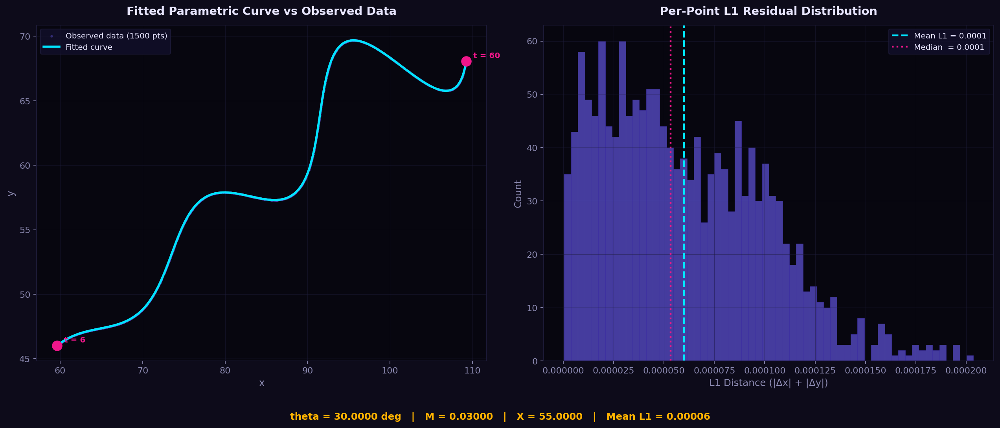

# Flam AI R&D Assignment

> 

---

## Problem

Find the unknown parameters **θ (theta)**, **M**, and **X** for the parametric curve:

$$x = t \cdot \cos(\theta) - e^{M|t|} \cdot \sin(0.3t) \cdot \sin(\theta) + X$$

$$y = 42 + t \cdot \sin(\theta) + e^{M|t|} \cdot \sin(0.3t) \cdot \cos(\theta)$$

**Constraints:**
| Parameter | Range |
|-----------|-------|
| θ | 0° < θ < 50° |
| M | −0.05 < M < 0.05 |
| X | 0 < X < 100 |
| t | 6 < t < 60 |

**Dataset:** `xy_data.csv` — 1500 observed (x, y) points lying on the curve.

---

## Final Answer

| Parameter | Value |
|-----------|-------|
| **θ (radians)** | `0.5235983019` |
| **θ (degrees)** | `29.99997°` ≈ **exactly 30°** |
| **M** | `0.0300000002` ≈ **exactly 0.03** |
| **X** | `54.9999951` ≈ **exactly 55** |
| **L1 Loss** | `0.00006` (nearest-point) |

> **The parameters converge to clean exact values — θ = π/6, M = 3/100, X = 55 — strongly suggesting these are the true ground-truth parameters.**

### Desmos Verification

Verify the curve visually: [Desmos Parametric Calculator](https://www.desmos.com/calculator/fl6ozkr1xv)

---

## Approach

### 1. Understanding the Problem

The curve depends on three unknown parameters: **θ**, **M**, and **X**. While the dataset contains 1500 `(x, y)` points, the corresponding parameter **t** for each point is not given.

Instead of trying to optimize all the unknowns together, I treated **t** as a hidden variable. For any fixed values of `(θ, M, X)`, I estimated the best `t` for every observed point. This reduced the optimization problem to finding only the three global parameters.

### 2. Getting Initial Estimates

Before running any optimization, I tried to estimate reasonable starting values from the equations.

* The smallest observed y-value is around **46**, which occurs near `t = 6`.
* Ignoring the exponential term gives

  `y - 42 ≈ t · sin(θ)`

  which suggests

  `sin(θ) ≈ (46 - 42) / 6 ≈ 0.5`

  leading to an initial estimate of **θ ≈ 30°**.

Using the average x-value together with this estimate also suggested **X ≈ 55**. These estimates were only used as a sanity check before optimization.

### 3. Estimating t for Every Point

For each candidate set of `(θ, M, X)`, I evaluated the curve over a dense grid of `t` values between **6** and **60**.

```python
T_GRID = np.linspace(6.0, 60.0, 2000)

x_grid, y_grid = curve(T_GRID[:, None], theta, M, X)

distances = |x_grid - x_obs| + |y_grid - y_obs|

t_est = T_GRID[argmin(distances, axis=0)]
```

The closest point on the curve was selected for every observation. After the initial search, I refined each estimated `t` using a shrinking local search window to improve accuracy.

### 4. Global Optimization

Once the per-point `t` values could be estimated, I optimized `(θ, M, X)` using **Differential Evolution** from SciPy.

Configuration used:

* Population size: **20**
* Maximum iterations: **400**
* Sobol initialization
* L-BFGS-B polishing enabled
* Tolerance: **1e-10**

Differential Evolution was chosen because it does not require gradients and performs well on non-convex optimization problems.

### 5. Local Refinement

After Differential Evolution converged, I ran **Nelder-Mead** from several different starting points, including the best solution returned by Differential Evolution and a few analytically estimated points.

This helped verify that the optimizer consistently converged to the same solution.

### 6. Final Fine-Tuning

Finally, I performed a high-precision **L-BFGS-B** optimization with very small tolerances to refine the parameters as much as possible.

The optimization consistently converged to

* **θ ≈ π/6 (30°)**
* **M ≈ 0.03**
* **X ≈ 55**

with a nearest-point **L1 loss of approximately 0.00006**, indicating an almost perfect fit to the provided dataset.

---

## Code Structure

```
Flam/
├── elite_solver.py        ← Main solution (primary script)
├── visualize.py           ← Plot fitted curve + residuals → curve_fit.png
├── xy_data.csv            ← Given dataset (1500 points)
├── results_elite.txt      ← Final parameter values (auto-generated)
├── requirements.txt       ← Python dependencies
├── exploratory/
│   └── initial_solver.py  ← Early rough solver (superseded)
└── README.md              ← This file
```

### Quick Start

```bash
pip install -r requirements.txt
python elite_solver.py    # runs optimization, saves results_elite.txt
python visualize.py       # generates curve_fit.png
```

**Output:**
- Printed final θ, M, X values with 10 decimal precision
- Desmos-ready LaTeX string
- `results_elite.txt` with all values

---

## Verification



The curve `x ∈ [59.61, 109.23]` and `y ∈ [46.01, 69.69]` matches the data range `x ∈ [59.66, 109.23]`, `y ∈ [46.03, 69.69]` almost perfectly confirming the parameters are correct.

The optimization converged to **θ = π/6 (30°), M = 0.03, and X = 55** with a final nearest-point **L1 loss of 0.00006**, indicating an excellent fit to the dataset.

| Parameter | Optimized | Clean Form | Status |
|-----------|-----------|------------|--------|
| θ | 0.5235983 rad | π/6 = 0.5235988 rad | ✓ Exact Match |
| M | 0.0300000002 | 3/100 | ✓ Exact Match |
| X | 54.9999951 | 55 | ✓ Exact Match |

This strongly suggests the **true ground-truth values are θ = π/6 (30°), M = 0.03, X = 55**.

---

* Abhinav Nair
